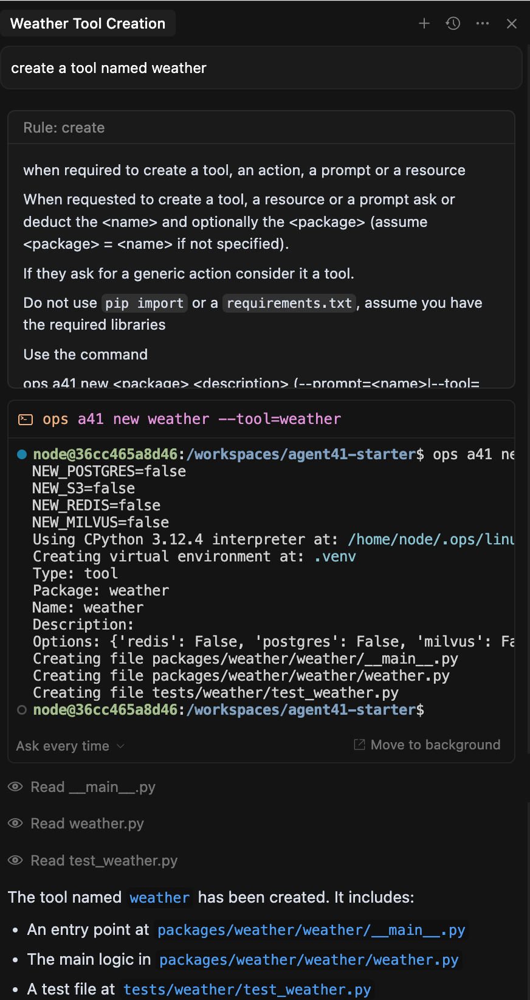
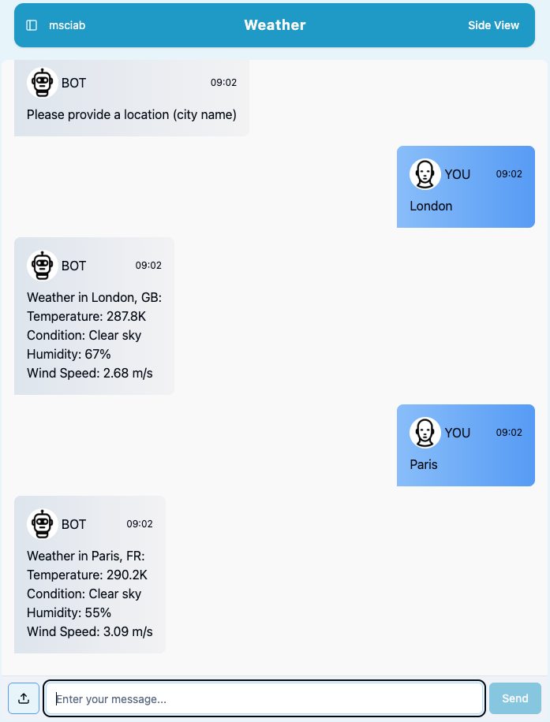

#### Agent41 Course

### **Lesson 1**
####  Vibe Coding with Cursor

---

 
 
 
 
 
 
 
 
 

# <!--fit-->`Install Cursor: https://cursor.com`

---

## Setup

1. Clone repo
1. Clone from GitHub
1. Allow GitHub access
1. Copy Device Code
1. Paste Device Code
1. Authorize VSCode
1. Clone
`mastrogpt/agent41-starter`
1. Open Devcontainer

---
1. Open AI Chat 
2. Create a New Chat
3. Select the context
   - File & Folders
   - Code
   - More...
4. Select the Mode
   - Agent
   - Ask 
   - Manual

---

## Modes

- **Agent**: fully  automated
   - Find the context
   - Propose solution
   - Implements them
- **Ask**
   - As agent but do not act
- **Manual**
   - You have to provide the context

---
## Contexts
- Files and Folders
- Code (snipptets)
- Docs
- Past git revisions
- Past chats
- Terminal commands
- Errors
- Web
- **Cursor Rules** 

---

 
 
 
 
 
 
 
 
 
 

## `Cursor Rules`

---

### Create Weather Tool

- `create a tool named weather`
  - **use a rule**
- `access to a service to get the wether in a location`
  - **asks a a question**
- `use openweather`

  - **my answer**

---

#### Implement Weather Tool

- `read the api key`

- `make a request to openwhethermap and retrieve the wheather for a given location`

- `add to the index`

- test and deploy

--- 

# Use Ollama to Parse Time

- `write a function ask_ollama to ask using model llama3.1:8b  and return its anwser`

  - it should select or use the `ollama` rule
   

- `write parse_time_and_location invoking ask_ollama assuming it is a request for a wheather prediction at a given location and optionally a time. Return the answer as a tuple with 3 values: the location of the request, the time of the request as a number of in hours in advance from now,  and the number of days in advance. Default to 0 for both if not specified`

--- 
#  Parse Time fixes and tests

- LLM does not know the current day and time we have to specify it
  - `provide the current time and date to the prompt`

- Sometimes the output is not a json object but is is embedded:
  - `check the respnse and extract a json object if it is embedded in the answer`

- We need to add tests:
  - `write tests to check form London, London tomorrow moning, Paris next Week and Moscow in the night`

---

## Close the loop fixing the `weather` function

`Change the weather function to use the parse_and_time location and use always a forecast. In the result answer specify the date and time for the forecast in the local time.`

`write tests for London, London tomorrow, Paris next week`
