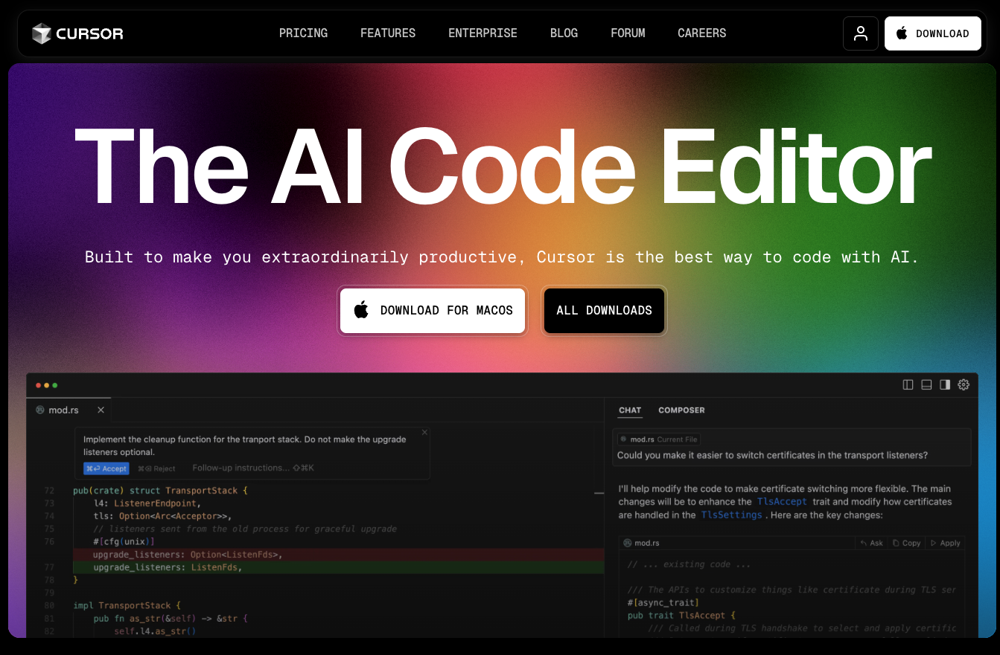
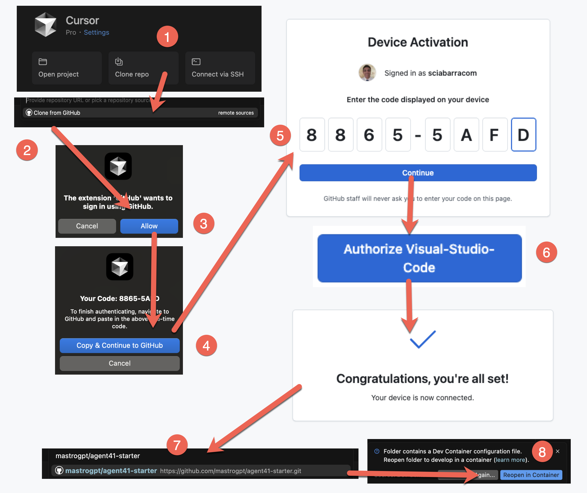
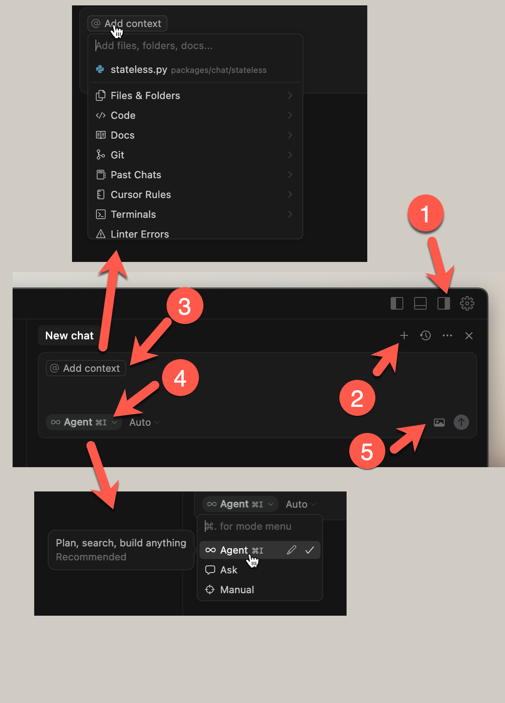
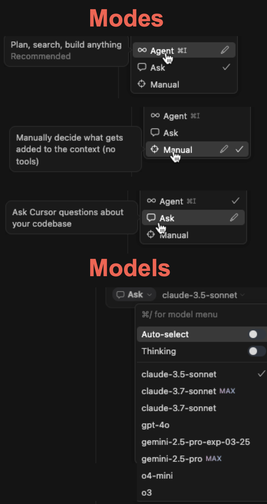
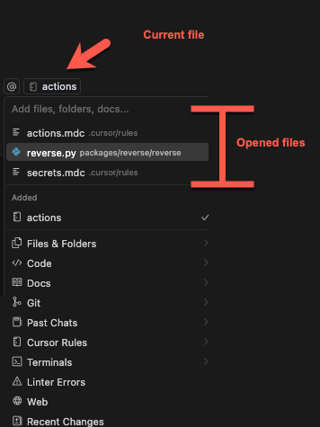
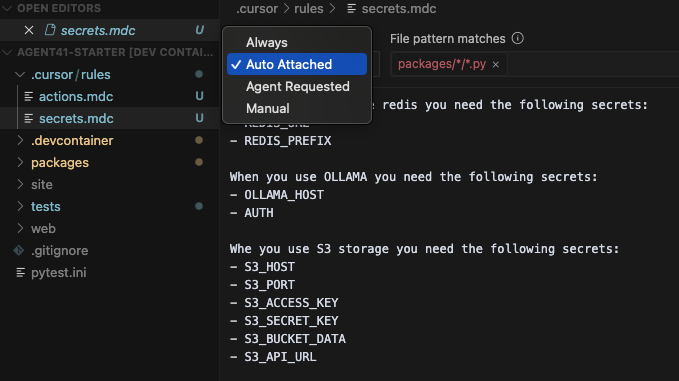

#### Agent41 Course

### **Lesson 1**
####  Vibe Coding with Cursor

---

 
 
 
 
 
 
 
 
 

# <!--fit-->`Install Cursor: https://cursor.com`

---

## Setup

1. Clone repo
1. Clone from GitHub
1. Allow GitHub access
1. Copy Device Code
1. Paste Device Code
1. Authorize VSCode
1. Clone
`mastrogpt/agent41-starter`
1. Open Devcontainer

---
1. Open AI Chat 
2. Create a New Chat
3. Select the context
   - File & Folders
   - Code
   - More...
4. Select the Mode
   - Agent
   - Ask 
   - Manual

---

# Modes

---
# Contexts

---

 
 
 
 
 
 
 
 
 
 

## `Cursor Rules`

---

