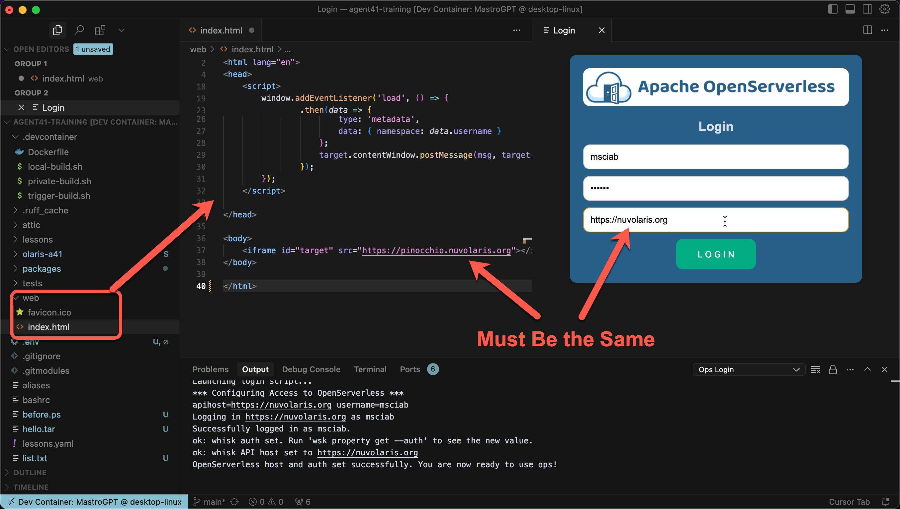
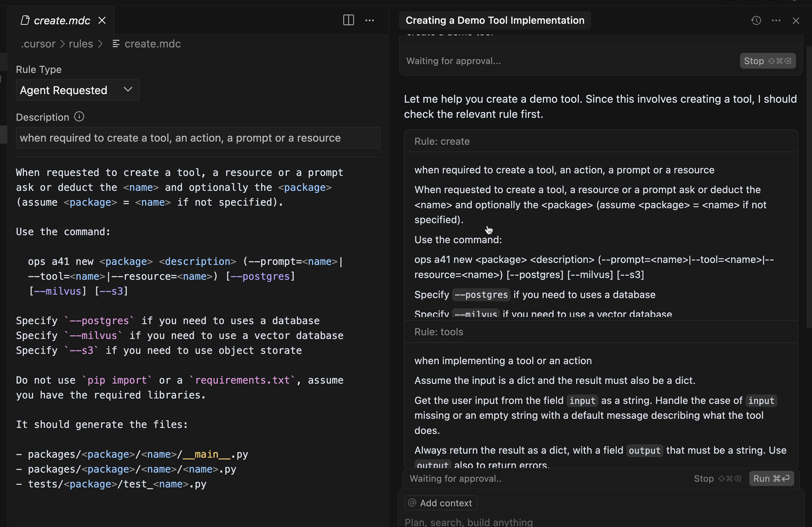
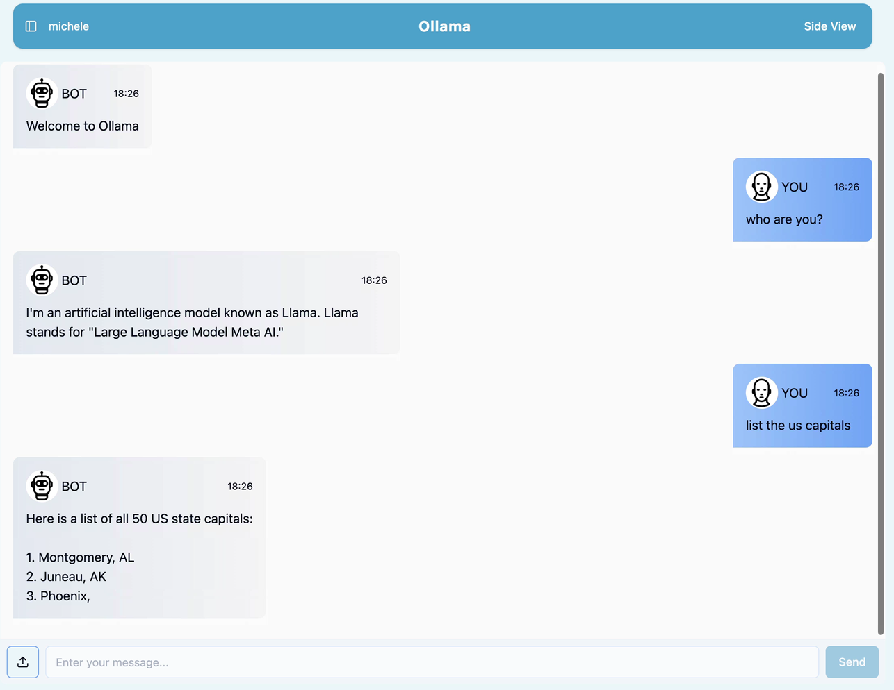

#### Agent41 Course

### **Lesson 1**
####  Vibe Coding with Cursor

---

 
 
 
 
 
 
 
 
 

# <!--fit-->`Install Cursor: https://cursor.com`

---

## Setup

1. Clone repo
1. Clone from GitHub
1. Allow GitHub access
1. Copy Device Code
1. Paste Device Code
1. Authorize VSCode
1. Clone
`mastrogpt/agent41-starter`
1. Open Devcontainer

---
# `Check Your Server`

---
1. Open AI Chat 
2. Create a New Chat
3. Select the context
   - File & Folders
   - Code
   - More...
4. Select the Mode
   - Agent
   - Ask 
   - Manual

---

## Modes

- **Agent**: fully  automated
   - Find the context
   - Propose solution
   - Implements them
- **Ask**
   - As agent but do not act
- **Manual**
   - You have to provide the context

---
## Contexts
- Files and Folders
- Code (snipptets)
- Docs
- Past git revisions
- Past chats
- Terminal commands
- Errors
- Web
- **Cursor Rules** 

---

 
 
 
 
 
 
 
 
 
 

## `Cursor Rules`

---

 ###### Demo of tool creation

1. Clean the chat
2. Manual: Create a tool, a Demo Tool
3. Restore checkpoint
4. Ask: create a demo tool
6. Agent: create a demo tool
5. Test it
6. Deploy it

---

- Demo Manual: create demo tool
  - Remove past chats
  - Create a demo tool in Manual mode
     -  The AI does not follow our rules
  - Restore Checkpoint
- Demo Ask: create demo tool
  - AI finds our rules
  - Note it needs the context to process

---
# Demo Agentic: create a demo tool
  - AI finds our rules
  - Agent **EXECUTES** our rules
  - Further decisions depends on the results
  - AI can make mistakes:
     - Not applying all the rules
     - Taking decions on unspecified behaviour
 

----

#### Demo Ollama:
  - Create a demo chat
  - Follows our rules
    - ollama.mdc
  - Makes a mistake on the API
    - Our rule does not specify which API to use
    - We need a manual fix

