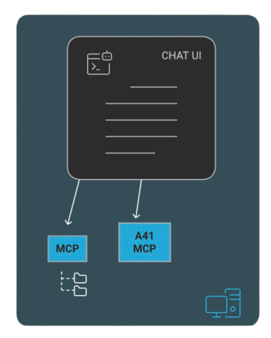
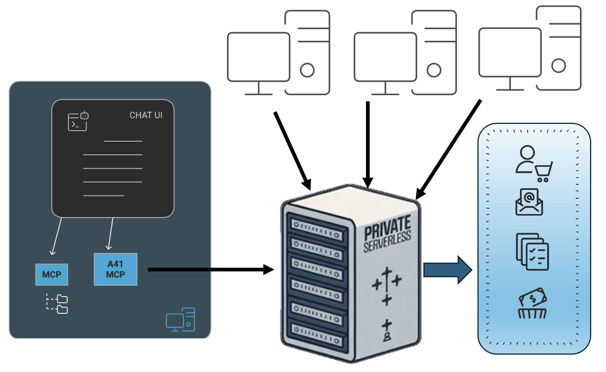

#### Agent41 Course
<center>

</center>

### **Lesson 2**
####  MCP Protocol

<center>

</center>


---

# What is MCP Protocol




---

# Agent41



---

# Installing an MCP Server in Cursor

```

```

---

# Installing an MCP Server in 5sire

---

# Using agent 41


---

# Installing agent 41

